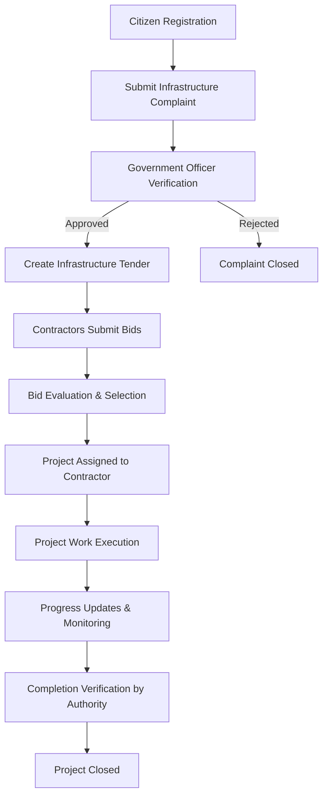

# 🌆 UrbanGrid - Smart City Infrastructure Management System

## Contributors

* Adarsh Malipatil — 241CS102
* Appaji Nagaraja Dheeraj — 241CS110
* Aryan Bokolia — 241CS111
* Rishinandan D R — 241CS145

---

## Overview

UrbanGrid is a Smart City Infrastructure Management System designed to streamline how urban infrastructure issues are reported, verified, and resolved. The platform integrates citizen complaints, government workflows, tender management, contractor bidding, and project execution into a unified relational database system.

UrbanGrid enables transparent governance and efficient coordination between ministries, departments, regional managers, and contractors.

---

## Key Features

* Citizen complaint reporting system
* Government verification workflow
* Tender creation and approval pipeline
* Contractor bidding system
* Project execution tracking
* Progress monitoring with updates
* Completion verification by authorities

---

## System Workflow

1. Citizens report infrastructure issues such as road damage, drainage problems, or street light failures.
2. Government officials verify submitted complaints.
3. Verified issues lead to creation of tenders by relevant ministries.
4. Contractors submit bids for the tenders.
5. The best bid is selected and the project is assigned.
6. Project progress is monitored and recorded.
7. Completion is verified by government authorities.

---

## System Flow



This workflow represents how UrbanGrid manages infrastructure issues from citizen reporting to final project completion.

---

## Development Setup

### Prerequisites

* Node.js 18+
* npm 9+
* MySQL 8+

### Install Dependencies

```bash
npm install
```

### Run Development Servers

```bash
npm run dev
```

### Run Only Frontend

```bash
npm run dev:frontend
```

### Run Only Backend

```bash
npm run dev:backend
```

The frontend runs on http://localhost:5173 and the backend API runs on http://localhost:5000.

### MySQL Setup

Create the database, then run the SQL script before starting the backend:

```bash
mysql -u root -p -e "CREATE DATABASE IF NOT EXISTS urbangrid"
mysql -u root -p urbangrid < backend/sql/prd_zero_redundancy.sql
```

Create `backend/.env` from `backend/.env.example` and set `MYSQL_PASSWORD` to your local MySQL password.

---

## Database Design

UrbanGrid uses a relational database structure containing entities such as:

* Citizens
* Government Users
* Ministries
* Departments
* Regions
* Complaints
* Tenders
* Contractors
* Bids
* Projects
* Progress Updates
* Verification Records

The schema ensures structured governance workflows and transparent infrastructure management.

---

## Objectives

* Improve transparency in infrastructure management
* Streamline complaint resolution workflows
* Enable efficient contractor bidding processes
* Track project execution and completion
* Support smart city governance through structured data systems


## Conclusion

UrbanGrid demonstrates how relational database systems can be used to build scalable smart city governance platforms that improve coordination between citizens, government authorities, and contractors.
